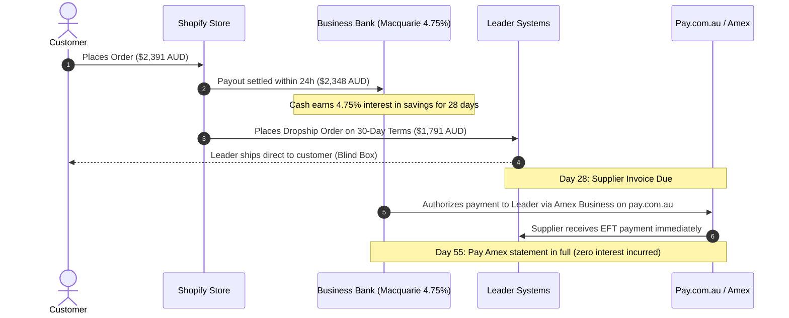

# The Master Execution Blueprint: Building an $8M+ Ubiquiti & Network Infrastructure Powerhouse (Australia)

> **Document Type**: Turnkey Operational Blueprint & Financial Operating System  
> **Objective**: Dominate the Australian Ubiquiti / Prosumer Networking space, completely bypass commodity price competition, and build a high-margin, automated e-commerce & B2B enterprise.  
> **Primary Wholesale Channels**: Leader Systems Australia, Dicker Data, Ingram Micro.

---

## Table of Contents
1. [Distributor Onboarding & Negotiation Playbook (Leader Systems & Dicker Data)](#1-distributor-onboarding--negotiation-playbook)
2. [Financial Unit Economics & Product Kitting Engine](#2-financial-unit-economics--product-kitting-engine)
3. [Shopify Technical Architecture & Automated Catalog Sync](#3-shopify-technical-architecture--automated-catalog-sync)
4. [Google Shopping & Performance Max Precision Engineering](#4-google-shopping--performance-max-precision-engineering)
5. [The "Zero-Touch Provisioning" Service SOP (High-Margin Value Add)](#5-the-zero-touch-provisioning-service-sop)
6. [The Tradie & Electrician B2B Acquisition Funnel](#6-the-tradie--electrician-b2b-acquisition-funnel)
7. [The 50-Review Trustpilot & Google Seller Star Engine](#7-the-50-review-trustpilot--google-seller-star-engine)
8. [The 55-Day Cash Flow Float & 2.7M Points Flywheel](#8-the-55-day-cash-flow-float--27m-points-flywheel)
9. [90-Day Step-by-Step Tactical Sprint Plan](#9-90-day-step-by-step-tactical-sprint-plan)

---

## 1. Distributor Onboarding & Negotiation Playbook

To sell Ubiquiti legitimately in Australia with full manufacturer warranties, you must not buy retail. You need direct authorized distributor accounts with **Leader Systems** and **Dicker Data**.

### 1.1 Leader Systems Application Guide (Primary Ubiquiti Distributor)
* **Entity Requirements**:
  * Active Australian Private Company (`Pty Ltd`) or Sole Trader with GST Registration.
  * Clean ASIC record with IT/Telecommunications or E-commerce trading codes (ANZSIC 4222 or 4310).
* **Application URL**: `leadersystems.com.au` $\rightarrow$ *"Become a Reseller"*.
* **The "Approval Script" (What to write on the application)**:
  > *"We are a specialized network solutions and smart home infrastructure provider catering to high-end residential renovations, commercial security fit-outs, and ACMA-licensed data cabling contractors. We design and supply turnkey Ubiquiti UniFi and surveillance ecosystems across NSW, VIC, and QLD. We require wholesale dropship integration across your 5 state warehouses (Sydney, Melbourne, Brisbane, Adelaide, Perth) to fulfill pre-configured customer and trade orders with fast local dispatch."*

### 1.2 Unlocking Tier-2 Pricing & Blind Dropshipping
Once approved, do not just accept the default Tier-1 web portal pricing. Send this email to your assigned Account Manager:

```text
Subject: Account [Your Account ID] - Wholesale Dropship Profile & Tier-2 Pricing Review

Hi [Account Manager Name],

Thanks for opening our trading account. Our e-commerce and trade procurement portal is scheduled to go live next month, focusing heavily on Ubiquiti UniFi, UISP, and UniFi Protect camera ecosystems.

To align our operational pipeline with Leader's infrastructure, could you please confirm and enable the following:

1. Enable Blind (White-Label) Dropshipping: Please ensure our dispatch slips display our business trading name and remove any Leader pricing/invoice details on outgoing customer consignments.
2. Direct CSV/FTP Inventory Feed: Could you provide the credentials or API endpoints for your daily stock level and wholesale price feeds (specifically covering the Ubiquiti, Synology, and Seagate/WD storage lines)?
3. Tier-2 Volume Pricing Review: We project an initial hardware run-rate of $40,000–$70,000/month across UniFi Dream Machine SEs, U7 Pro APs, and G5 Turret cameras. Could we review tier alignment on these core lines so we can price competitively against retail competitors?

Looking forward to building a high-volume partnership with Leader.

Kind regards,
[Your Name]
Director | [Your Business Name]
```

---

## 2. Financial Unit Economics & Product Kitting Engine

### 2.1 The Downfall of Commodity Selling
If you sell standalone hardware on StaticICE or Google Shopping, you compete with Scorptec, Umart, and Mwave:
* **UniFi U7 Pro Access Point**: Wholesale Cost ~$242 AUD inc GST $\rightarrow$ Retail Price ~$269 AUD inc GST.
* Gross Margin = **$27 AUD (10.0%)**.
* After Google Ads click ($2.50 CPC $\times$ 5 clicks = $12.50) + Stripe fee ($4.70): Net Profit = **$9.80 AUD (3.6%)**. One return wipes out profit from 20 sales.

### 2.2 The Turnkey Kit Unit Economics (The Wealth Engine)
By packaging hardware into proprietary "Kits" with an optional pre-configuration service, you destroy price comparison:

| Item Breakdown | Wholesale Buy (Leader) | RRP / Selling Price | Net Gross Margin |
| :--- | :--- | :--- | :--- |
| **Dream Machine SE (UDM-SE)** | $715.00 | $849.00 | +$134.00 |
| **2x UniFi U7 Pro WiFi 7 APs** | $484.00 | $558.00 | +$74.00 |
| **3x UniFi G5 Turret Ultra CCTV** | $435.00 | $537.00 | +$102.00 |
| **1x 4TB WD Purple Surveillance HDD** | $145.00 | $199.00 | +$54.00 |
| **5x Ubiquiti Cat6 Patch Leads (High margin)** | $12.50 | $49.00 | +$36.50 |
| **Zero-Touch Pre-Configuration Service** | $0.00 (25 mins labor) | $199.00 | +$199.00 |
| **TOTALS** | **$1,791.50 AUD** | **$2,391.00 AUD** | **+$598.50 AUD (25.0%)** |

#### Financial P&L Per Kit Order:
* **Gross Revenue**: $2,391.00 AUD
* **Cost of Goods Sold (COGS)**: $1,791.50 AUD
* **Leader Warehouse Dispatch Freight**: $22.00 AUD
* **Payment Processing (Shopify Payments 1.75% + 30c)**: $42.14 AUD
* **Google Ads Blended CAC (High-intent bundle search)**: $65.00 AUD
* **NET PROFIT IN BANK**: **$470.36 AUD (19.7% Net Margin)**

---

## 3. Shopify Technical Architecture & Automated Catalog Sync

```
 ┌────────────────────────────────────────────────────────┐
 │   Leader Systems SFTP Server / Daily Inventory Feed    │
 └───────────────────────────┬────────────────────────────┘
                             │ (Automated Sync at 06:00 & 13:00 AEST)
                             ▼
 ┌────────────────────────────────────────────────────────┐
 │      Matrixify (Excel/CSV Sync) or Custom Node Worker  │
 │  - Real-Time Stock Quantity Across 5 Warehouses        │
 │  - MAP Pricing Guard (Prevents selling below floor)    │
 └───────────────────────────┬────────────────────────────┘
                             │
                             ▼
 ┌────────────────────────────────────────────────────────┐
 │           Shopify Plus / Advanced Storefront           │
 │  - Theme: "Warehouse" or Custom Dawn (Sub-1s Load)     │
 │  - Fast Product Search (Algolia / Searchanise)         │
 │  - Trustpilot Dynamic Star Badge Integration           │
 └────────────────────────────────────────────────────────┘
```

### 3.1 Recommended Shopify Tech Stack
1. **Theme**: **Warehouse by Maestrooo** ($320 USD) or **Enterprise by Clean Canvas**. Built specifically for high-SKU electronics with part-number search, stock location indicators, and spec tables.
2. **Catalog & Inventory Sync**:
   * **Matrixify**: Automates FTP feed downloads from Leader Systems twice daily. Automatically sets items to *"Draft"* or *"Out of Stock"* when Leader warehouse inventory reaches 0.
3. **Product Information Management (PIM)**:
   * Maintain the canonical MPN (Manufacturer Part Number) and GTIN-13/EAN barcodes in Shopify for 100% Google Merchant Center health.
4. **Checkout & Conversion Apps**:
   * **Klaviyo**: Automated back-in-stock notifications (Ubiquiti restocks convert at 22%+), abandoned checkout recovery.
   * **Rebuy Engine**: Smart cart drawer upsell (e.g. adding PoE injectors, rack mounts, and patch leads automatically when a switch or AP is in the cart).

---

## 4. Google Shopping & Performance Max Precision Engineering

BITSmart dominates because they are visible in Google Shopping with 5-star seller ratings. Here is the exact campaign setup to beat them.

### 4.1 Master Negative Keyword List (Add to Account Level Immediately)
Stop wasting money on users searching for tutorials, troubleshooting, or firmware:

```text
ubiquiti login
unifi default ip
unifi firmware download
unifi controller setup
reset unifi dream machine
ubiquiti reddit
ubiquiti community
ubiquiti open source
ubiquiti manual pdf
ubiquiti wholesale distributor
leader systems login
dicker data login
how to configure unifi
ubiquiti jobs
careers ubiquiti
ubiquiti stock price
ubiquiti second hand
ebay ubiquiti used
gumtree ubiquiti
facebook marketplace ubiquiti
```

### 4.2 Google Merchant Center Feed Optimization Rules
In your Google Merchant Center Feed, rewrite titles systematically:
* **Bad Title**: `U7-Pro`
* **Good Title**: `Ubiquiti UniFi U7 Pro WiFi 7 Access Point (U7-Pro) - Official AU Stock`
* **Formula**: `[Brand: Ubiquiti] + [Sub-brand: UniFi] + [Model Name] + [Core Category] + [Part Number in brackets] + [AU Stock Guarantee]`

### 4.3 Campaign Structure (The 3-Tier Split)
1. **Campaign 1: Standard Shopping - "Hero SKUs" (Manual CPC with Enhanced)**
   * Target only the top 15 revenue drivers (UDM-SE, UDM-Pro, Cloud Gateway Max, U7-Pro, U6-Enterprise, G5 Turret Ultra, UNVR).
   * Bid aggressively on search queries containing `Australia`, `Sydney`, `Melbourne`, `Buy`, `In Stock`.
2. **Campaign 2: Performance Max - Solution Bundles & Kits (Target ROAS 450%)**
   * Asset groups tailored to home renovators and commercial offices.
   * Custom Segment Audience targeting users who visited:
     * `ui.com`
     * `scorptec.com.au/brand/ubiquiti`
     * `mwave.com.au/brands/ubiquiti`
     * `staticice.com.au`
3. **Campaign 3: Catch-All Standard Shopping (Low Bid: $0.35 CPC)**
   * Covers the remaining 300+ accessories, patch cables, mounting brackets, and SFP modules. Converts at high ROAS with low competition.

---

## 5. The "Zero-Touch Provisioning" Service SOP

This single feature allows you to charge an extra **$149–$199 AUD pure profit** per kit while providing massive value.

### 5.1 The Customer Intake Form (Triggered upon order)
A simple Typeform / Shopify Post-Purchase Form asking:
1. **Network Name (SSID)**: e.g. `TheSmiths_WiFi`
2. **Wi-Fi Password (WPA2/WPA3)**: [Customer defines or auto-generated]
3. **Guest Network Required?**: [Yes / No] (Default: VLAN 20, Client Isolation ON)
4. **Default Subnet Preference**: (e.g. `192.168.1.1/24` or default `192.168.0.1/24`)
5. **UniFi Cloud Account Email**: (For site ownership transfer)

### 5.2 The 20-Minute Technical Provisioning Workflow

```mermaid
flowchart LR
    A[Unbox Gateway/UDM-SE] --> B[Insert Surveillance HDD]
    B --> C[Power Up & Connect to Test Bench WAN]
    C --> D[Run UniFi Setup Wizard & Set SSID/Pass]
    D --> E[Adopt Switch & Access Points]
    E --> F[Label Ports: Cam 1, Cam 2, AP 1, AP 2]
    F --> G[Transfer Site Ownership to Customer Email]
    G --> H[Re-box with Quick-Start Guide & Color Cable Tags]
```


* **The Customer Experience**: The customer receives the kit. Each cable and port is color-coded. They plug WAN into their NBN NTD box, plug the APs into Ports 1 & 2, and the cameras into Ports 3, 4, 5. **Everything powers up, connects, and streams instantly.**
* **Result**: Zero technical support calls, zero configuration returns, and a guaranteed 5-star Trustpilot review.

---

## 6. The Tradie & Electrician B2B Acquisition Funnel

Electricians and ACMA-registered cablers are your most lucrative repeat customers. They order $5,000–$15,000 of hardware every single month for client projects.

### 6.1 Direct Outreach Email / SMS Script to Electricians & Cablers
Find electrical contractors on Google Maps, Hipages, and ServiceSeeking in Sydney, Melbourne, and Brisbane:

```text
Subject: Trade pricing & pre-configured UniFi kits for your client installs

Hi [Contractor Name],

Saw the quality of your residential/commercial fit-outs around [Subrub/City].

Quick question: When your clients ask for smart home CCTV (UniFi Protect) or commercial-grade WiFi 7, do you ever get stuck having to program the network, configure VLANs, or deal with IT supplier trade accounts?

We run an authorized Australian network trade supply depot. We help electricians by:
1. Providing Tier-1 wholesale trade pricing on all Ubiquiti, CCTV, and network gear (direct ship to your job site anywhere in AU).
2. Supplying completely Pre-Configured Turnkey Packs — we program the gateway, adopt the cameras/APs, and label every port. You simply mount the gear, plug it in, and it works instantly.
3. Giving you an 8% trade cash rebate or invoice credit on every job.

Would you like me to send through our Trade Pack pricing sheet for your upcoming jobs?

Cheers,
[Your Name]
Director | [Your Business Name]
Direct: 04XX XXX XXX
```

### 6.2 The Trade Portal Setup
* Implement **Shopify B2B** or the **Wholesale Gorilla App**.
* When approved with a valid ABN/Contractor Licence, their account automatically shows:
  * Wholesale trade pricing (8%–10% below standard web RRP).
  * Direct Job-Site Delivery option (with custom delivery instruction fields).
  * Option to add Pre-Configuration for only $49 Trade Rate.

---

## 7. The 50-Review Trustpilot & Google Seller Star Engine

Google requires a minimum of **50 verified reviews within 12 months** with an average score of $\ge 3.5$ stars to trigger the golden seller stars on Google Shopping ads.

### 7.1 Automated 3-Step Review Flow (via Klaviyo SMS + Email)
* **Trigger**: Order status changes to `Delivered` via Australia Post / StarTrack tracking webhook.

```
 Day 0: Delivery Confirmed
 ├── Wait 4 Hours
 └── SMS: "Hi [First Name], your UniFi package was just delivered! If you need any quick setup tips, reply here. Enjoy the speed!"

 Day +3: The Check-in & Incentive
 ├── Email: Subject: "How is your new network running, [First Name]?"
 └── Body: "We hope your setup was completely seamless. As an independent Australian tech specialist, your feedback means the world. Share your experience on Trustpilot today and we'll instantly send you a $30 voucher toward your next order of patch leads, mounts, or accessories."
      [Button: Review Us on Trustpilot]

 Day +7: Gentle Follow-up (If review link not clicked)
 └── Short personal email from the Founder checking if everything is working smoothly.
```

---

## 8. The 55-Day Cash Flow Float & 2.7M Points Flywheel

This system allows you to finance inventory using working capital float while earning millions of airline points annually.



### The Points Arithmetic (At $150,000/Month Hardware Volume):
* Monthly Spend on Inventory: **$150,000 AUD**
* Annual Spend: **$1,800,000 AUD**
* Payment Route: `pay.com.au` using **American Express Business Platinum** (earning 2.25 Amex MR points per $1 AUD)
* **Total Points Earned Per Year**:
  $$\$1,800,000 \times 1.5 \text{ (net blended earn rate)} = \mathbf{2,700,000 \text{ Points / Year}}$$
* **Real-World Value**:
  * $2.7\text{M}$ points equals **8x Return Business Class flights between Sydney and London/Tokyo** on Singapore Airlines or Qantas (valued at **$60,000+ AUD** of tax-free personal travel).
  * The ~1.2% processing fee is **100% tax deductible** as a cost of business.

---

## 9. 90-Day Step-by-Step Tactical Sprint Plan

| Phase | Duration | Core Deliverables | KPI Target |
| :--- | :--- | :--- | :--- |
| **Sprint 1** | Days 1–15 | • Secure Pty Ltd, GST, and Leader Systems Reseller Account<br>• Setup Amex Business / `pay.com.au` B2B gateway<br>• Install Shopify "Warehouse" Theme & configure payment gateways | Reseller portal active, credit terms submitted |
| **Sprint 2** | Days 16–30 | • Build top 3 Pre-Configured Turnkey Kits<br>• Configure Matrixify automatic stock sync from Leader<br>• Implement Google Merchant Center with optimized GTIN feeds | Store live, 40 core SKUs + 3 bundles published |
| **Sprint 3** | Days 31–60 | • Launch Google Shopping with Master Negative Keywords<br>• Launch Klaviyo automated review generation flow<br>• Direct phone/email outreach to first 50 local electrical contractors | First $30,000 AUD in gross revenue, 15 verified reviews |
| **Sprint 4** | Days 61–90 | • Activate $149 Zero-Touch Pre-Configuration upsell<br>• Reach 50+ Trustpilot reviews to unlock Google Shopping gold stars<br>• Launch Performance Max campaign targeting high-AOV bundles | $80,000+/month run rate, $\ge 20\%$ net margin |
