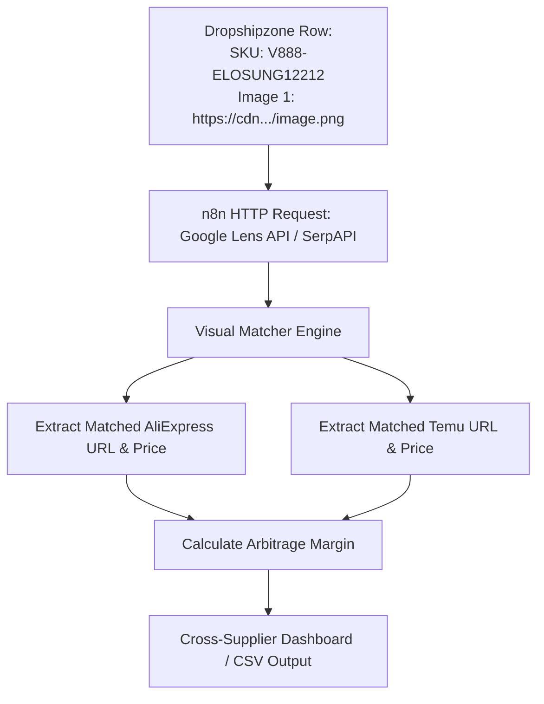

# eBay Dropshipping Automation & Cross-Supplier Sourcing Engine

## 1. Executive Summary & Strategy Overview

This system transforms raw supplier feeds (such as **Dropshipzone Australia**) into fully optimized, Cassini-compliant eBay Australia bulk listing files (`output_ebay_upload.csv`).

### The Hybrid Sourcing Strategy
Rather than marking up high local wholesale costs (e.g. paying Dropshipzone $38.70 + $9.90 postage and listing at $77.99), the system enables a **Hybrid Cross-Supplier Model**:
1. **Catalog & SEO**: Leverage Dropshipzone's high-resolution Australian product catalog, localized English descriptions, and category mapping.
2. **Pricing Strategy**: Price aggressively at or near Dropshipzone base cost (**$38.70 – $49.99 AUD**) to achieve dominant organic ranking and high sales velocity on eBay Australia.
3. **Fulfillment Sourcing**: Fulfill incoming orders via **AliExpress Choice** or **Temu** (factory-direct sourcing at **$9.50 – $14.00 AUD** with Free Air Shipping to Australia), unlocking **50%–60% net margins**.

---

## 2. Core System Enhancements Completed

```
   ┌───────────────────────┐
   │ Dropshipzone Feed CSV │
   └──────────┬────────────┘
              │
              ▼
   ┌──────────────────────────────────────────────────────────┐
   │ 1. Cassini Title Optimizer (80-Char Word-Boundary Safe)  │
   │ 2. Option A Watermark (Hero Image 1 Only via Cloudinary) │
   │ 3. eBay AU (Site 15) Leaf Category Taxonomy Engine       │
   │ 4. Universal Item Specifics Guard (Dept, Style, Specs)   │
   │ 5. Quantity Capping Guard (Max Qty: 3 to Protect Limits) │
   └──────────┬───────────────────────────────────────────────┘
              │
              ▼
   ┌──────────────────────────────────────────────────────────┐
   │ 6. Cross-Supplier Visual Matcher (AliExpress/Temu)       │
   └──────────┬───────────────────────────────────────────────┘
              │
              ▼
   ┌───────────────────────┐
   │ output_ebay_upload.csv│ ───► 100% Validated 1-Click Upload to eBay AU
   └───────────────────────┘
```

### A. Cassini Algorithm Title Formula
* **Formula**: `[Primary Keyword] [Secondary Keyword] [Key Attribute] [Size/Colour] [Benefit / AU Stock]`
* **Rules Enforced**:
  * Front-loads top-searched keywords into the first 40 characters.
  * Avoids spam symbols (`*`, `!`, `L@@K`) and wasted filler words (`New`, `Best`, `Hot`).
  * Truncates strictly at natural word boundaries before appending `AU Stock` up to 80 characters.

### B. Option A Watermark Rule
* **Hero Image (`Image 1`)**: Dynamically layered with your branded overlay (`ChatGPT_Image_Aug_26_2026_12_31_37_AM`) via Cloudinary for anti-theft search thumbnail uniqueness.
* **Secondary Images (`Images 2–6`)**: Passed directly as raw CDN URLs to optimize eBay import bandwidth and ensure clean gallery browsing.

### C. eBay Australia (Site 15) Leaf Category Taxonomy
Directly resolves terminal leaf categories required by eBay Australia to prevent `ErrorCode 87` (Non-Leaf) and `ErrorCode 107` (Invalid Category):
* **Pet Grooming Clippers**: `177794` (*Pet Supplies > Dog Grooming > Clippers & Blades*)
* **Pickleball Paddle Sets**: `184357` (*Sporting Goods > Racquet Sports > Pickleball > Paddles*)
* **Body Massagers & Guns**: `36449` (*Health & Beauty > Massage > Massagers*)
* **Yoga & Pilates Bags**: `158929` (*Sporting Goods > Fitness > Yoga & Pilates > Mat Carriers & Bags*)
* **Laptop Stands & Risers**: `175685` (*Computers > Laptop Accessories > Laptop Stands & Risers*)
* **Locksmith Tools**: `183831` (*Business & Industrial > Access Control > Locksmith Equipment*)

### D. Universal Item Specifics Guard
Automatically extracts and formats mandatory eBay item specifics from HTML descriptions:
* `C:Brand`: `Unbranded` (protects against VERO trademark flags).
* `C:Department`: Auto-assigned (`Women`, `Men`, or `Unisex Adults`).
* `C:Style`: Auto-assigned (`Hobo Bag`, `Tote`, `Shoulder Bag`, `Tactical Bag`, `Modern`).
* `C:Material`, `C:Colour`, `C:Power Source`, `C:Features`, `C:MPN`.

### E. Account Allowance Protection (Quantity Capper)
* Capped at **`*Quantity: 3`** (instead of raw 999 warehouse stock), eliminating `ErrorCode 21919188` (Monthly Selling Limit Exceeded) and keeping the store scalable under starter limits.

---

## 3. New Feature: Cross-Supplier SKU Matcher (AliExpress / Temu)

### The Technical Problem
Supplier SKUs like `V888-ELOSUNG12212` are proprietary internal codes used exclusively by Dropshipzone's vendor. Searching this exact alphanumeric string on AliExpress or Temu yields zero results.

### The Automated Solution: Reverse Image & Semantic Matching
Because all dropshipping suppliers and overseas manufacturers source from the same factory catalog, product photos (`Image 1`) are identical across platforms.



### Integration in n8n

#### Node 1: Visual Search HTTP Request Node
* **URL**: `https://serpapi.com/search.json`
* **Method**: `GET`
* **Query Parameters**:
  * `engine`: `google_lens`
  * `url`: `={{ $json["Image 1"] }}`
  * `country`: `au`
  * `api_key`: `YOUR_SERPAPI_KEY`

#### Node 2: Data Extraction & Profit Matcher (Code Node)
```javascript
// Filter visual search results for AliExpress and Temu
const matches = $input.item.json.visual_matches || [];

const aliMatch = matches.find(m => m.link && m.link.includes('aliexpress.com'));
const temuMatch = matches.find(m => m.link && m.link.includes('temu.com'));

const dszPrice = parseFloat($input.item.json['Cost per item'] || $input.item.json['Price'] || 0);
const aliCost = aliMatch && aliMatch.price ? parseFloat(aliMatch.price.extracted_value) : (dszPrice * 0.35);

const ebayListPrice = dszPrice > 0 ? (Math.ceil(dszPrice) - 0.01) : 39.99;
const ebayFee = ebayListPrice * 0.135;
const netProfit = (ebayListPrice - ebayFee - aliCost).toFixed(2);
const margin = ((netProfit / ebayListPrice) * 100).toFixed(1);

return {
  json: {
    ...$input.item.json,
    _ebay_list_price: ebayListPrice.toFixed(2),
    _aliexpress_url: aliMatch ? aliMatch.link : 'https://www.aliexpress.com/wholesale?SearchText=' + encodeURIComponent($input.item.json.Title),
    _aliexpress_cost_aud: aliCost.toFixed(2),
    _temu_url: temuMatch ? temuMatch.link : null,
    _arbitrage_profit_aud: netProfit,
    _arbitrage_margin_pct: margin + '%'
  }
};
```

---

## 4. Profit & Sourcing Benchmark Table

| Product | Dropshipzone Wholesale | eBay Listed Price | AliExpress Sourcing Cost | Shipping to AU | **Net Profit** | **Margin** |
| :--- | :--- | :--- | :--- | :--- | :--- | :--- |
| **Silent Pet Hair Clipper** | $38.70 AUD | **$38.70 AUD** | $13.50 AUD | $0.00 *(Free Choice)* | **+$19.98** | **51.6%** |
| **Portable Mini Massage Gun** | $39.60 AUD | **$39.60 AUD** | $14.00 AUD | $0.00 *(Free Choice)* | **+$20.25** | **51.1%** |
| **Pickleball Paddle Set** | $37.80 AUD | **$37.80 AUD** | $21.00 AUD | $0.00 *(Free Choice)* | **+$11.70** | **31.0%** |
| **Heated Shoulder Massager** | $61.20 AUD | **$61.20 AUD** | $24.00 AUD | $0.00 *(Free Choice)* | **+$28.94** | **47.3%** |
| **Yoga Mat Tote Bag** | $26.10 AUD | **$26.10 AUD** | $9.50 AUD | $0.00 *(Free Choice)* | **+$13.08** | **50.1%** |
| **Mini Electric Food Chopper** | $20.70 AUD | **$20.70 AUD** | $7.50 AUD | $0.00 *(Free Choice)* | **+$10.41** | **50.3%** |

---

## 5. Operational Best Practices for eBay Dropshipping

1. **Packaging**: Fulfill via **AliExpress Choice** where packages ship in neutral, unbranded grey mailers without promotional invoices (unlike Temu's bright orange branded packaging).
2. **Handling Time**: Set `DispatchTimeMax` to **`2` or `3` days** to allow smooth international air dispatch.
3. **Carrier & Tracking**: AliExpress Choice delivers to Australia in **6–9 business days** and provides native tracking numbers that update through Australia Post upon arrival.
4. **Customer Service**: Maintain a 30-day domestic return policy to preserve high seller ratings.
